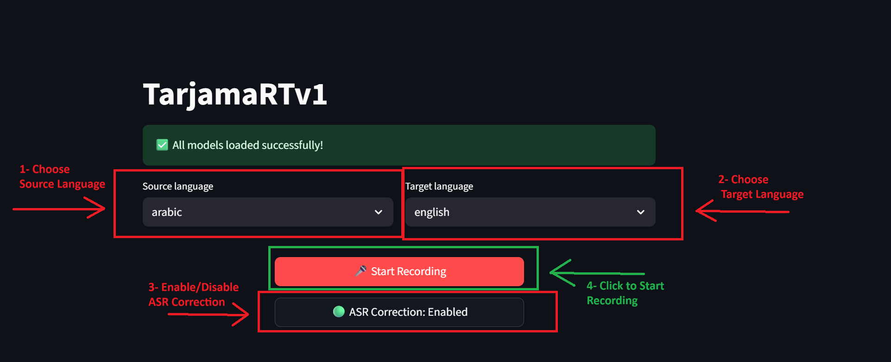
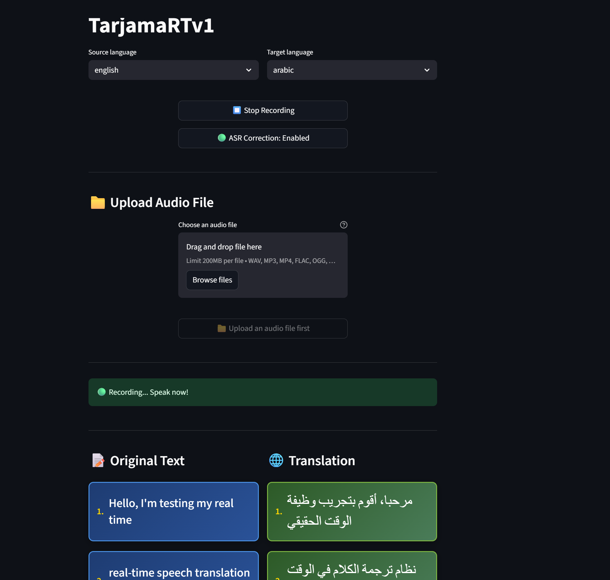
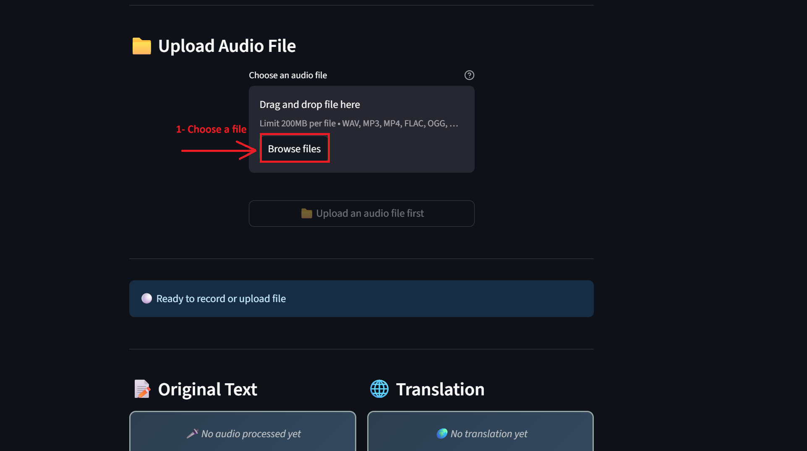
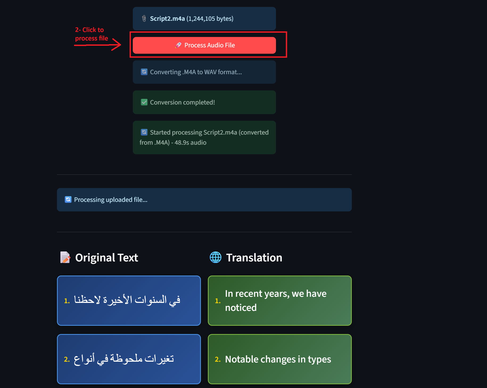

# 🎤 TarjamaRT - Real-Time Translation Usage Guide

This guide will walk you through using the real-time translation system with both live recording and file upload features.

## 📋 Table of Contents
- [Live Recording Workflow](#live-recording-workflow)
- [File Upload Workflow](#file-upload-workflow)
- [Settings & Configuration](#settings--configuration)
- [Tips for Best Results](#tips-for-best-results)

---

## 🎙️ Live Recording Workflow

### Step 1: Choose Source Language

*Select your source language from the dropdown menu. This is the language you will be speaking.*

### Step 2: Choose Target Language

*Select your target language from the dropdown menu. This is the language you want your speech translated to.*

### Step 3: Enable/Disable ASR Correction

*Toggle ASR correction on/off. When enabled, the system will use AI to improve transcription quality by removing duplicate words and fixing spelling mistakes.*

### Step 4: Start Recording

*Click the "Start Recording" button to begin live translation. The system will process your speech in real-time.*

### Results: Live Translation Output

*Your speech is transcribed and translated in real-time. Each segment shows the original text and its translation.*

---

## 📁 File Upload Workflow

### Step 1: Choose Audio File

*Click "Choose an audio file" to upload an audio file for processing. Supported formats include .m4a, .mp3, .wav, and more.*

### Step 2: Process the File

*After selecting your file, click "Process Audio File" to begin transcription and translation.*

### Results: File Processing Output

*The system processes your audio file and displays the transcription and translation results. Processing time and statistics are shown at the top.*

---

## ⚙️ Settings & Configuration

### Language Options
- **Source Languages**: Arabic, English, Spanish, French, German, and more
- **Target Languages**: All supported languages available for translation

### ASR Correction
- **Enabled**: Uses AI to improve transcription quality
  - Removes duplicate words between segments
  - Fixes common spelling mistakes
  - Provides better context-aware corrections
- **Disabled**: Uses raw ASR output without post-processing
  - Faster processing
  - May include duplicate words and spelling errors

### Processing Information
- **Chunks Processed**: Number of audio segments analyzed
- **Segments Found**: Number of speech segments detected
- **Processing Time**: Total time taken for file processing

---

## 💡 Tips for Best Results

### For Live Recording:
1. **Speak clearly** and at a moderate pace
2. **Minimize background noise** for better transcription
3. **Use ASR correction** for better accuracy (recommended)

### For File Upload:
1. **Use high-quality audio files** when possible
2. **Ensure clear speech** without heavy background noise
3. **Longer files** may take more time to process
4. **Check processing statistics** to monitor performance

### General Tips:
- **ASR correction** is recommended for most use cases
- **Language selection** must match the actual spoken language
- **Processing time** varies based on file length and system performance
- **Results are displayed** in real-time for live recording

---

## 🔧 Troubleshooting

### Common Issues:
- **No audio detected**: Check microphone permissions and audio levels
- **Poor transcription**: Ensure clear speech and minimal background noise
- **Slow processing**: Large files may take longer; check system resources
- **Language mismatch**: Verify source language matches the spoken language

### Getting Help:
- Check that all models are loaded before starting
- Ensure stable internet connection for ASR correction
- Verify audio file format is supported
- Check system requirements in README.md

---

*For technical setup and installation instructions, please refer to the README.md file.*
